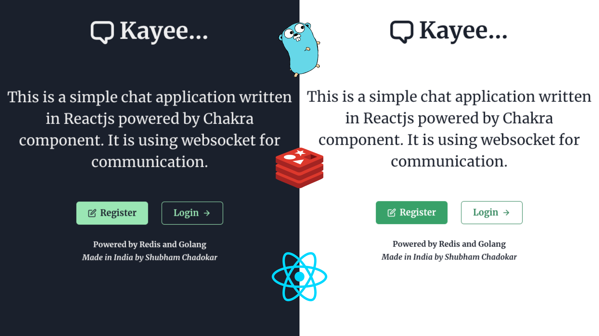

# Kayee... Chat Application

A detailed article is published on [Medium](https://levelup.gitconnected.com/create-a-chat-application-in-golang-with-redis-and-reactjs-c75611717f84).




## Setup

### Step 1
Clone the repository

### Step 2
Run `git mod tidy` to install all the Golang dependencies.

### Step 3
Go to `clients` and to install frontend dependencies.

```node
npm install
```

## Run the Application
### Terminal 1
Start HTTP server
```
go run main.go --server=http
```

### Terminal 2
Start WebSocket server

```
go run main.go --server=websocket
```

### Terminal 3
Go to `client` and run

```
npm start
```

Application is live at `localhost:3000`. 

.gif)
